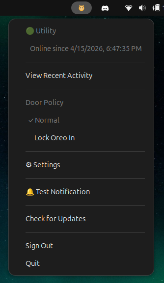
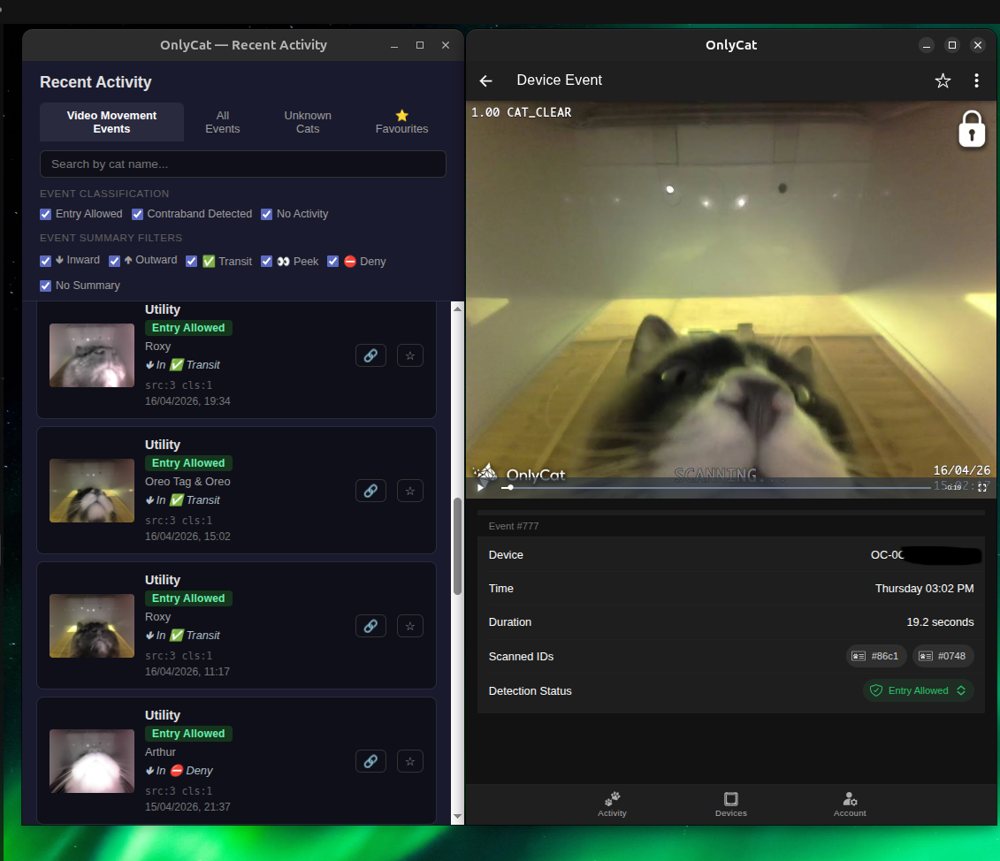

# OnlyCat Tray App

A cross-platform desktop system tray application for [OnlyCat](https://onlycat.com) smart cat flap owners. Monitor your devices, get real-time notifications when your cat comes and goes, and view event videos — all from your system tray.


---

## Screenshots

### Tray Menu


### Activity Window


---

## Features

- **Device Health dashboard** — time-series graphs for WiFi signal, battery voltage, CPU temperature, uptime, and storage
- **Favourites** — star events to save them locally, view in the Favourites tab
- **Export events** — export the currently visible events to CSV with one click
- **Auto-start on login** — optional toggle in Settings to launch OnlyCat on system startup
- **Live event summaries** — summaries update automatically as events are processed by the API
- **SQLite event database** — events cached locally between sessions; only new events fetched on subsequent startups
- **System tray icon** — runs silently in the background with a badge showing missed events
- **Tray tooltip** — hover the tray icon to see the last event with cat name, summary, and relative time (Windows/macOS)
- **Cat last-seen in tray menu** — each device shows its cats with their last action and relative time; click to view the event video
- **Ignored Cats** — hide specific cats from the tray menu's last activity display via Settings
- **Real-time notifications** — desktop notification when your cat is detected, with cat name, time, and event classification (Entry Allowed, Contraband Detected)
- **Recent Activity window** — browse your full event history with thumbnails, cat names, and timestamps
  - Four tabs: Video Movement Events / All Events / Unknown Cats / Favourites
  - Search by cat name
  - Filter by event classification
  - Filter by direction (🢃 Inward / 🢁 Outward) and action (✅ Transit / 👀 Peek / ⛔ Deny)
  - Share event URL with one click
  - Export filtered events to CSV
- **Event summaries** — direction and action shown per event with emoji indicators
- **Video viewer** — click any event or notification to open the full event video
- **Door Policy control** — switch between door policies directly from the tray menu
- **Device status** — see online/offline status and uptime for each device
- **Settings** — manage device token, auto-start, notification filters, ignored cats, and test notifications from one window
- **Unknown Cats** — identify events from unregistered RFID chips
- **Auto-reconnect** — automatically reconnects if the connection drops
- **Check for Updates** — checks GitHub releases for newer versions

---

## Installation

Download the latest installer for your platform from the [Releases](https://github.com/dcninja/onlycat-tray-app/releases) page:

| Platform | File |
|----------|------|
| Linux (Debian/Ubuntu) | `.deb` |
| Linux (other) | `.AppImage` |
| macOS | `.zip` |
| Windows | `.exe` |

### Linux AppImage
```bash
chmod +x OnlyCat-*.AppImage
./OnlyCat-*.AppImage
```

### Linux .deb
```bash
sudo dpkg -i onlycat-tray-app_*.deb
```

---

## First Run

1. Launch the app — it will appear in your system tray
2. Right-click the tray icon and you'll be prompted to enter your **Device Token**
3. Find your device token in the OnlyCat app under device settings
4. Once connected, your devices and recent activity will be available from the tray

Your token is stored securely using your OS keychain (or encrypted local storage as fallback).

---

## Usage

### Tray Menu
- **Device list** — shows each device with online status and uptime
- **Cat last-seen** — shows each cat's last action and time; click to view the event video
- **Door Policy** — switch the active door policy with a single click
- **View Recent Activity** — opens the activity window
- **Device Health** — opens the telemetry dashboard with time-series graphs
- **⚙ Settings** — configure notifications, ignored cats, device token, and auto-start
- **Check for Updates** — checks for a newer version on GitHub
- **Sign Out** — clears your stored token

### Recent Activity
- Browse all events with thumbnails, cat names, timestamps, and event summary (direction + action)
- Switch between **Video Movement Events**, **All Events**, **Unknown Cats**, and **⭐ Favourites** tabs
- **Unknown Cats** — shows events with RFID codes not in your saved cat name cache
- Search by cat name using the search box
- Filter by classification, direction (🢃/🢁) and action (✅/👀/⛔) using the checkboxes
- Click an event to open the video
- Click 🔗 to copy the shareable event URL
- Click ⭐ to favourite an event (stored locally)
- Click 📥 Export to save the currently visible events as CSV

### Notifications
When a new event is detected you'll receive a desktop notification showing:
- Device name and classification (🟢 Entry Allowed / 🔴 Contraband Detected)
- Cat name (if RFID chip detected)
- Time of event
- Event summary with emojis on a new line (e.g. 🢃 In ✅ Transit)
- Thumbnail image

Click the notification to open the event video directly.

### Settings
Click **⚙ Settings** in the tray menu to configure:
- View and change device token
- Start OnlyCat on login
- Send a test notification
- Ignored cats — hide specific cats from the tray menu
- Video movement only toggle
- Event classification filters
- Direction filters (Inward/Outward)
- Action filters (Transit, Peek, Deny)
- Events without summary data

---

## Building from Source

### Prerequisites
- Node.js 20+
- npm

```bash
git clone https://github.com/dcninja/onlycat-tray-app.git
cd onlycat-tray-app
npm install
npm run build
npm start
```

### Package for distribution
```bash
npm run dist:linux   # Linux .deb + AppImage
npm run dist:mac     # macOS .zip
npm run dist:win     # Windows .exe
```

---

## Privacy & Security

- Your device token is stored locally using OS-level encryption (`safeStorage`)
- Cat name mappings (RFID → name) are cached locally to minimise API calls
- No data is sent anywhere other than the official OnlyCat gateway (`gateway.onlycat.com`)
- The app uses a single persistent WebSocket connection — no polling

---

## Requirements

- An [OnlyCat](https://onlycat.com) smart cat flap
- A valid device token (found in the OnlyCat app)
- Linux with AppIndicator support (GNOME, KDE, XFCE), macOS 10.13+, or Windows 10+

---

## License

MIT
